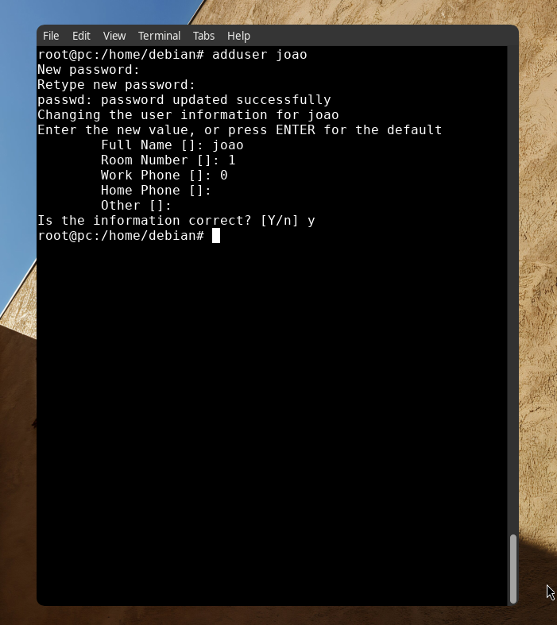
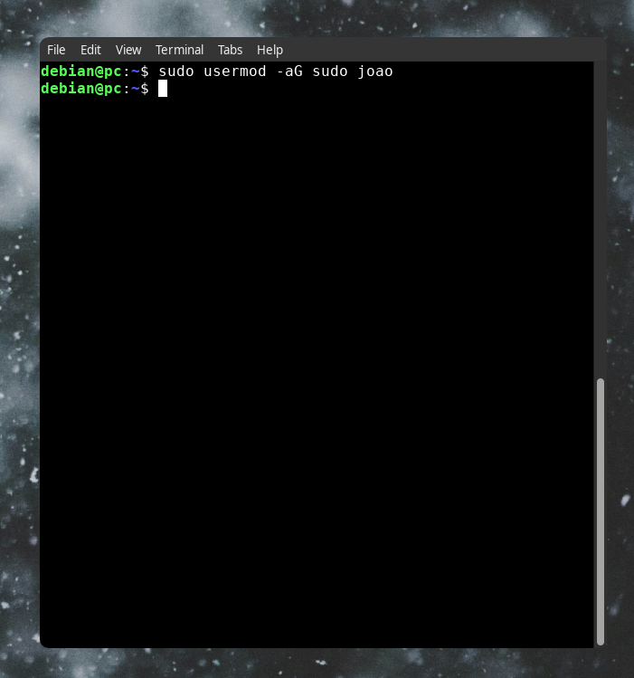
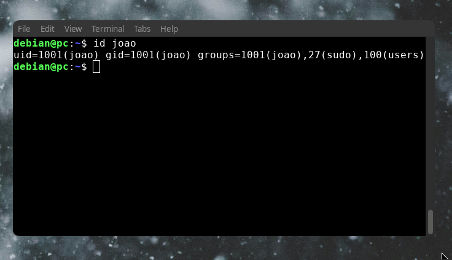
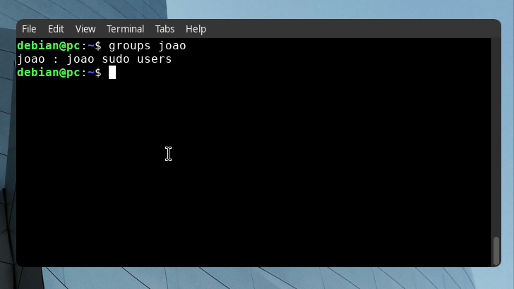

>Laboratorio pratico desenvolvido durante meus estudos de administracao Linux
# User Management

## Scenario
New user named **joao** needs acess to a Debian server. The objective is to create the account, grant administrative priviligies and verify the config.

## Objective
- Criar um usuario;
- Conceder privilegios administrativos ao novo usuario;
- Comfirmar que o usuario pertence ao grupo "sudo".

## Environment
- S.O: Debian 13 
- Window Manager: i3wm
- Usuario: debian
## Create user

```bash
sudo adduser joao
```
Create a new user named **joao** and asks for configurations of password and additional information.

## Result


## Adicionar o novo usuario ao grupo sudo

```bash
sudo usermod -aG sudo joao
```
Adds the user **joao** to the group 'sudo' allowing to execute administratie commands

## Result


## Verify user

```bash
id joao
```

## Result


## Verify groups 

```bash
groups joao
```

## Results



## O que aprendi
- Criar usuario;
- Adicionar usuario ao grupo sudoers;
- Verificar UID  e GID;
- Confirmar grupos do usuarios;

## Conclusion
This lab demosntrated the basic process of creating users, assigning administrative priviligies and verifying account information on Debian


## Reference
https://manpages.debian.org
https://wiki.debian.org/
https://www.gnu.org/software/coreutils
