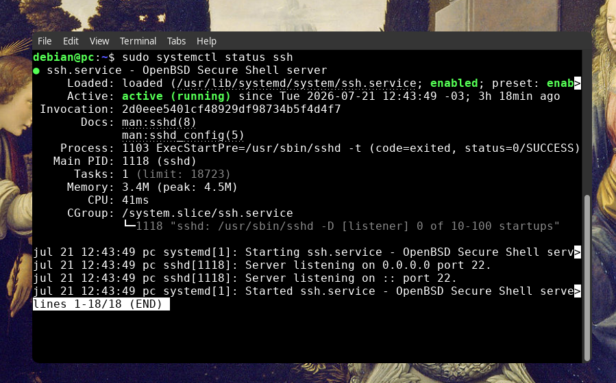
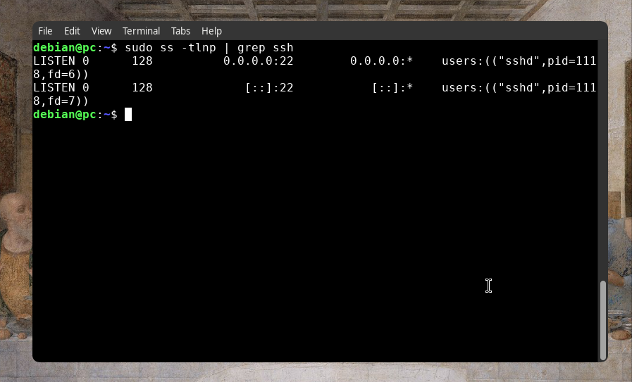

# SSH (secure shell)

## Cenario
Computador precisa verificar a estabilidade do servico do ssh e fazer um conexao com um dominio

## Objetivo
Aprender a instalar, configurar e utilizar o servico SSH para administracao remota de servidores Debian.


## Ambiente
PC Debian 13 i3wm
Usuario: debian

## Instalar OpenSSH server
```bash
sudo apt update
sudo apt install openssh-server -y
```
## Verificar o status do servico

```bash
sudo systemctl status ssh
```
Verifica se o servico esta em execucao

## Iniciar o servico
```bash
sudo systemctl start ssh
```
## Habilitar na inicializacao
```bash
sudo systemctl enable ssh
```
## Reiniciar o servico
```bash
sudo sysmtectl restart ssh
```
## Conectar a outro computador
```bash
ssh usuario@12.168.1.100
```
## Arquivo de configuracao
```text
/etc/ssh/sshd_config
```
## Reiniciar o SSH apos alteracao no arquivo de config
```bash
sudo systemctl restart ssh
```

## Verificar se a porta 22 esta aberta
```bash
sudo ss -tlnp | grep ssh
```

## O que aprendi

-instalar openssh server
-gerenciar o servico com systemd
-reaalizar o servico com systemd
-realizar conexoes remotas via SSH
-identificar o arquivo principal de configuracao
-reiniciar o servico apos alteracao
